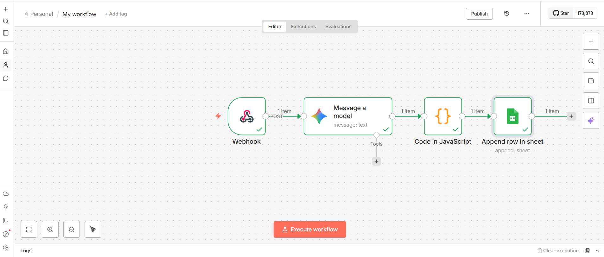
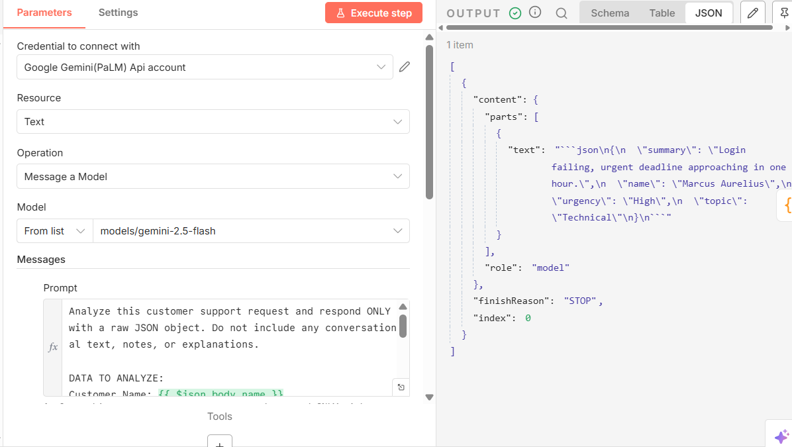

# intelligent-workflow-assistant

Project Title: AI-Powered Support Triage and Task Automation
The Mission :
This project was built to solve a common bottleneck for customer support teams: the manual processing of incoming requests. This Digital Sidekick automates the journey from raw email input to structured, actionable data, allowing humans to focus on solving problems rather than logging them.

Tech stack/Toolkit:
 
Automation Engine: n8n (Workflow Orchestration)

AI Intelligence: Google Gemini 1.5 Flash (Natural Language Processing)

Input Method: Webhook API (Accepting JSON payloads)

Data Storage: Google Sheets (Real-world API Integration)

Custom Logic: JavaScript (Data sanitization and JSON parsing)

Overview of the solution :

Trigger: A Webhook receives an "email-style" JSON payload (simulating an incoming support ticket).

Intelligence: The data is passed to Google Gemini. Using a custom system prompt, the AI analyzes the message to extract the customer's name, categorize the topic, determine urgency, and generate a concise summary.

Refinement: A JavaScript Code Node cleans the AI's output, stripping Markdown formatting and converting the text into a structured JSON object that other apps can understand.

Task Creation: The workflow connects via API to Google Sheets, automatically appending a new row with the timestamped, categorized task.

Proof of Concept:

1. The Workflow Canvas
This is the end-to-end automation map showing the connection between the API trigger, the AI brain, and the final spreadsheet destination.

3. The AI Intelligence in Action
Here is a look at the raw brain of the assistant. You can see how the AI takes a messy message and turns it into clean data.

5. The Final Task Log (Google Sheets)
The final destination. Every row here was generated without a single human keystroke. 

Setup and Installation : 

Import Workflow: Import the provided .json file into your n8n instance.

AI Credentials: Connect your Google Gemini API key to the Gemini Node.

Storage: Connect your Google Account and select a spreadsheet in the Google Sheets Node.

Trigger: Use the Webhook URL provided by n8n.

Run: Send a POST request via ReqBin or Postman with the following structure:

JSON
{
  "name": "Marcus Aurelius",
  "email": "marcus@rome.com",
  "message": "I am unable to access my account and I have an urgent deadline!"
}

Future Extensibility (The Next Steps)
Instant Notifications: Add a Slack/Discord node to ping the team immediately for "High" urgency tasks.

Sentiment Analysis: Track customer frustration levels numerically to prioritize angry customers.

Auto-Responder: Integrate a Gmail node to send a "We are on it!" email back to the customer using AI-personalized text.
